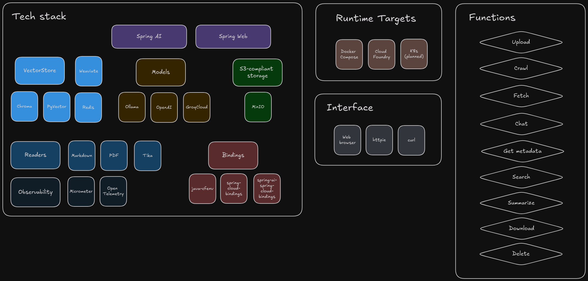

# Sanford

     

Sanford utilizes LLMs, a storage bucket, and a Vector store to search for, chat with, and/or summarize documents that you upload.  Use standalone or with [sanford-ui](https://github.com/cf-toolsuite/sanford-ui).

* [Prerequisites](docs/PREREQUISITES.md)
* [Considerations](docs/CONSIDERATIONS.md)
* [Tools](docs/TOOLS.md)
* How to
  * [Clone](docs/CLONING.md)
  * [Build](docs/BUILD.md)
  * [Run](docs/RUN.md)
  * [Consume endpoints](docs/ENDPOINTS.md)
* [Addenda](docs/ADDENDA.md)
* [Credits](docs/CREDITS.md)
* Podcasts/Talks/Conferences
  * 2024-12-12 @ Seattle Java Users Group - [Spring AI: Where Java becomes Your GenAI Huckleberry](https://speakerdeck.com/pacphi/spring-ai-where-java-becomes-your-genai-huckleberry)
  * 2024-10-31 @ Cloud Foundry Weekly - [Episode 34: Exploring Sanford, GenAI, & cf-toolsuite updates](https://www.youtube.com/watch?v=agpvplJcTXc)

